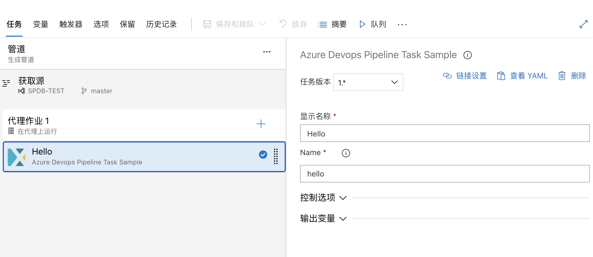
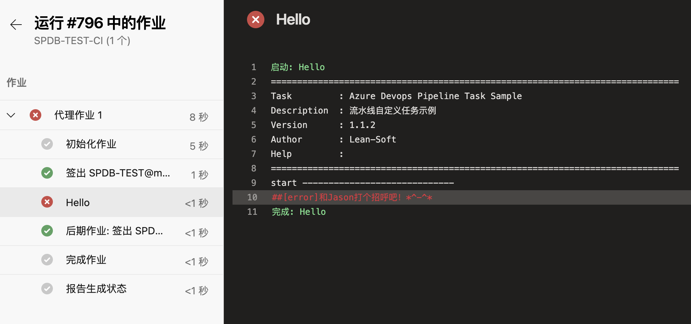

[](https://github.com/smallidea/azure-devops-extension-pipeline-task-sample) 

# azure devops 流水线插件的示例

## 概述
正如标题所述这是一个简易的流水线任务插件的示例，比起官方的要简单很多，可以让大家快速上手。

输入框

流水线运行结果


**参考文档**
- 官方教程: https://docs.microsoft.com/zh-cn/azure/devops/extend/develop/add-build-task?view=azure-devops


## 如何开始
1. 初始化
``` shell 
## 克隆git库，并进入目录
git clone https://github.com/smallidea/azure-devops-extension-pipeline-task-sample.git
cd azure-devops-extension-pipeline-task-sample

## 安装根目录下运行命令所需要的包
npm install

## 安装流水线插件运行时所需要的包
cd src/tasks/sample && npm i && cd ../../../
```

2. 点击F5可以进行调试，调试的相关配置在 `.vscode\launch.json` 文件中 ，可参考 [使用vs code调试](https://code.visualstudio.com/docs/editor/debugging)
3. 运行 `npm run publish`，里面的tfs地址和token需要根据具体项目进行修改
   > 如果需要在流水线中看到debug信息，CI（管道）中有一个勾选功能“启用系统诊断”，如果是CD（发布）需要手动设置System.Debug为true
4. 手动安装并启用插件
   - 集合设置 > 扩展 > 浏览本地插件 > 管理本地扩展 > 上传扩展 > 浏览本地文件上传插件
   - 点击进入插件详情 > 免费获取 > 选择集合，点击启用
   > [官方文档](https://docs.microsoft.com/zh-cn/azure/devops/extend/publish/command-line?view=azure-devops&viewFallbackFrom=vsts)
5. 手动更新插件
   - 集合设置 > 扩展 > 浏览本地插件 > 管理本地扩展
   - 找到需要更新的插件，点击名称后的三个点 > 选择更新 > 浏览本地文件上传插件

## 开发
1. 目录结构
``` tree
.
├── README.md              
├── develop.md
├── package.json                          npm run 所用到的命令配置
├── src                                   源码文件
│   ├── static                            静态文件
│   │   └── images                        目前只有一个logo文件
│   └── tasks                             流水线任务集合
│       └── sample                        流水线任务示例
│           └── task.json                 任务中的配置
│           └── tsconfig.json             typescript的相关配置
│           └── package.json              引用的包配置，需要在sample目录下执行npm i
│           └── index.ts                  主文件
└── vss-extension-sample.json             插件发布配置文件
```
2. API

`azure-pipelines-task-lib`

| 函数                   | 用途                                                                     |
| --------------------------- | ------------------------------------------------------------------------- |
| getInput()                  | 获取流水线上输入框录入的值      |


